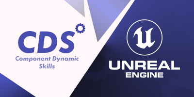
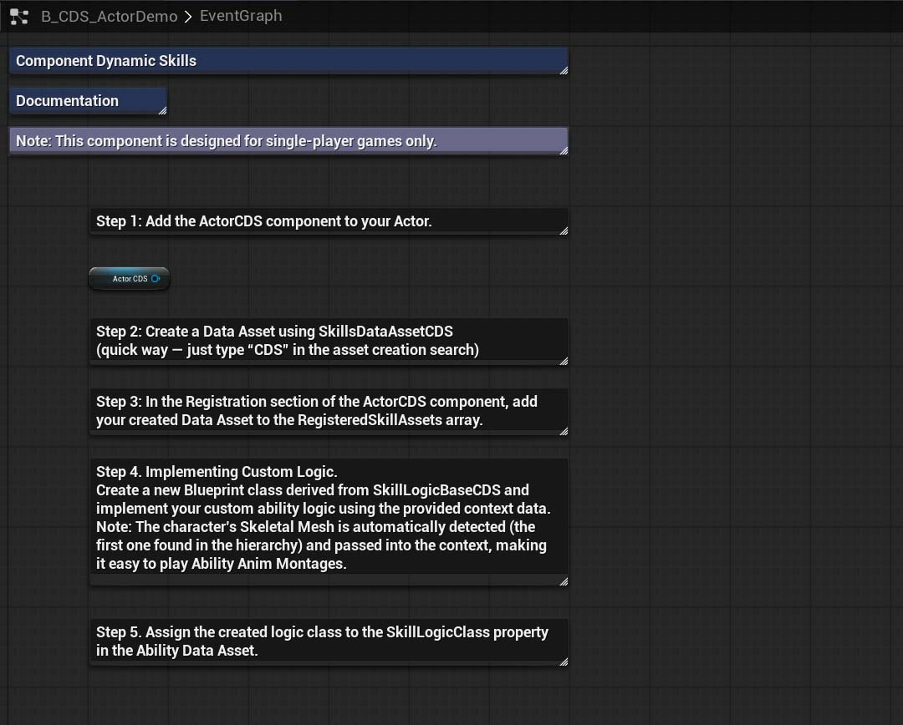
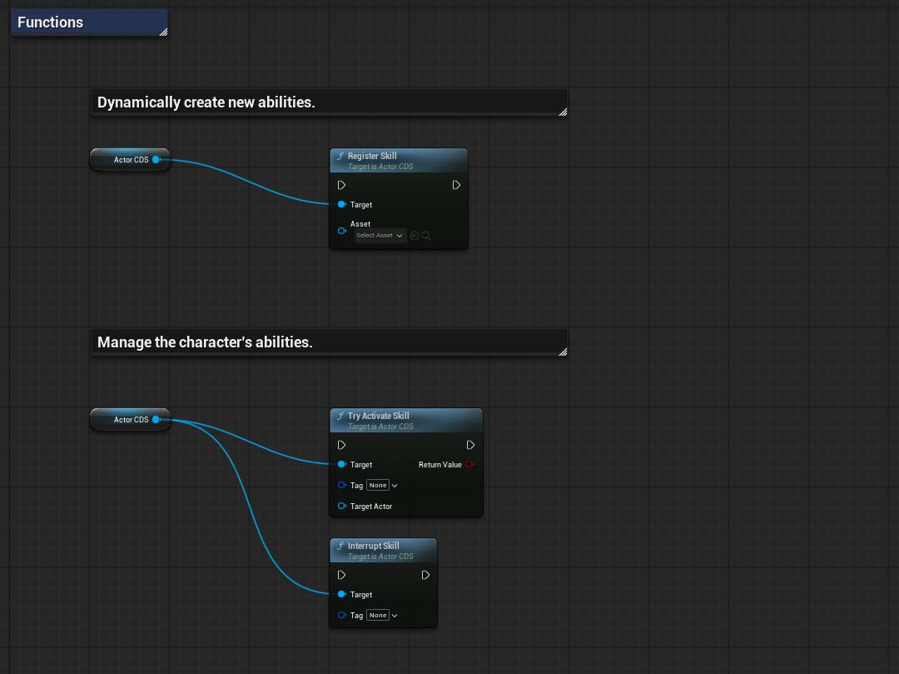
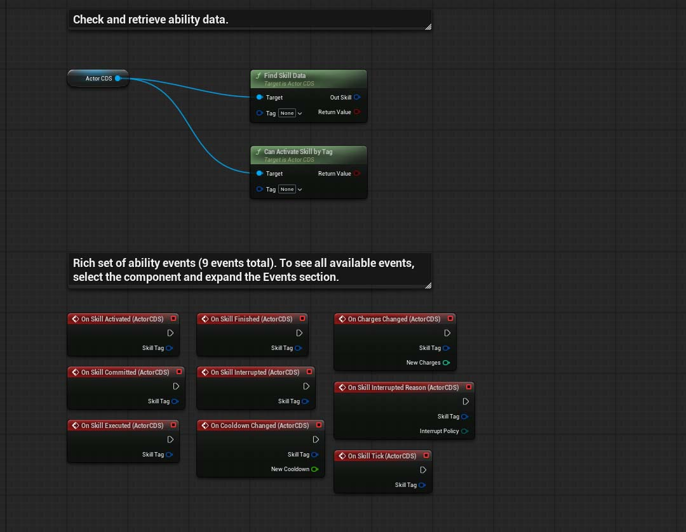

# Component Dynamic Skills
Unreal Engine 5 Actor Component for managing dynamic abilities in single-player games. This is a greatly simplified version of Unreal Engine’s Gameplay Ability System (GAS), designed to make creating single-player games much easier and more accessible.

 

> [!NOTE]
> The plugin has been pre-packaged only for Win64 and Android.

## Latest Updates
`Experimental`

`Version 1.1.1`
- Built for Unreal Engine 5.7.4.
- Refactored the code.
- Improved the UX for configuring ability data.
- Added ability collection registration.
- Numeric ability parameters are now linked to `GameplayTags`, allowing you to create any number of custom parameters individually for each ability.
- Added a way to integrate abilities into the State Tree via the new `STTask_ExecuteSkillCDS` class. In the `SkillsDataAssetCDS` asset, you can now add `SkillContextDataAssetCDS` settings to the `ContextBindings` field to specify any number of AI settings, which are conveniently organized by section. These settings can include parameters such as the NPC HP threshold for retreating, checking whether the NPC should stop before using a skill, etc. This means you can configure the skill processing system for multiple NPC classes and adjust the balance all from one place.
- Expanded references for animations, effects, and projectiles.
- Added fields for sounds and decals.

`Minor`

- Added new contextual data types: Vector, Other Assets.
- Added a new `GetContextData` function to retrieve contextual data by tag.
- Fixed bugs in the State Tree Task CDS class. Added debug messages.

## What it's for
- Management and configuration of player character abilities, featuring the ability to pass data into the State Tree.

## Features
- Support for dynamic creation of abilities.
- Create, group, and blend ability setting contexts with subsequent integration into the State Tree.
- Encapsulated logic with rich context data.
- Quick search by typing "CDS" — easily find all related classes and functions. No need to remember long function names — simply type “CDS” in the search box and start creating!
- Automatic detection of the character’s Skeletal Mesh for the encapsulated ability logic context.
This is especially useful when you need to play Anim Montages inside the ability logic.

## Install

> [!NOTE]
> Starting with Unreal Engine version 5.6, it is recommended to use the new project type based on C++. After copying the plugin folder, be sure to perform a full project rebuild in your C++ IDE.

1. Make sure the Unreal Engine editor is closed.
2. Move the "Plugins" folder to the root folder of your created project.
3. Rebuild the project in your C++ IDE.
4. Done! The 'Component Dynamic Skills' folders should appear in the Unreal Engine browser and the plugin should be automatically activated. If the plugin folder is not visible, activate visibility through the browser settings: `Settings > Show Plugin Content`.

## How to use it?
An interactive step-by-step tutorial on how to use CDS can be found in the file: `B_CDS_ActorDemo`, which is located at the path `Plugins\ComponentDynamicSkills\`.

## (C++) Documentaion
All sources contain self-documenting code.
